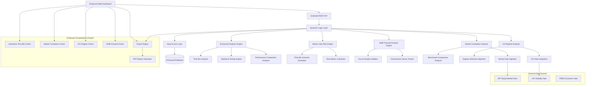

# Advanced Trading Analytics - Design Document

## Overview

The Advanced Trading Analytics enhancement extends the existing Trading Optimization Platform with sophisticated quantitative analysis capabilities focused on account/30-minute time bin combinations. The system will provide statistical confidence in trading decisions by implementing comprehensive performance analysis with market benchmark comparisons, Monte Carlo risk assessment, Walk-Forward Analysis validation, and VIX volatility regime analysis. The design emphasizes rigorous statistical testing to distinguish genuine alpha from random noise while ensuring the predicted "best" account/30-min bin combinations remain effective across different market conditions.

## Architecture

The enhanced system builds upon the existing modular architecture while adding specialized analytics engines:



### Technology Stack Enhancements

**New Components:**
- **Market Data Integration**: yfinance, pandas-datareader for SPY/QQQ/VIX data
- **Statistical Analysis**: scipy.stats, statsmodels for advanced statistical testing
- **Regime Detection**: scikit-learn clustering, Hidden Markov Models
- **Performance Attribution**: pyfolio, empyrical for risk-adjusted metrics
- **Parallel Processing**: joblib, multiprocessing for Monte Carlo simulations
- **Advanced Visualization**: plotly.graph_objects for complex multi-axis charts

**Enhanced Existing:**
- **Database**: Extended schema for market data and regime indicators
- **API**: New endpoints for time-bin analysis, market correlation, and data export
- **Frontend**: Enhanced React components with market context visualization and export functionality

**New Export & Reporting:**
- **Data Export**: pandas, openpyxl for Excel export, CSV generation
- **PDF Generation**: reportlab, matplotlib for professional trading reports
- **File Management**: pathlib, zipfile for organized export packages

## Components and Interfaces

### 1. Enhanced Analytics Engine

**Purpose**: Provides comprehensive time-bin focused analytics with statistical rigor.

**Key Classes**:
```python
class TimeBinAnalyzer:
    def get_time_bin_trades(self, account: str, hour: int, minute_bin: int) -> List[Trade]
    def calculate_time_bin_metrics(self, trades: List[Trade]) -> TimeBinMetrics
    def test_statistical_significance(self, metrics: TimeBinMetrics) -> SignificanceTest

class StatisticalTestingEngine:
    def bootstrap_confidence_intervals(self, data: List[float], confidence: float) -> ConfidenceInterval
    def test_performance_persistence(self, historical: List[float], recent: List[float]) -> PersistenceTest
    def multiple_comparison_correction(self, p_values: List[float], method: str) -> List[float]

class PerformanceComparisonAnalyzer:
    def compare_time_bins(self, bin1: TimeBinMetrics, bin2: TimeBinMetrics) -> ComparisonResult
    def rank_time_bins_by_significance(self, time_bins: List[TimeBinMetrics]) -> List[RankedTimeBin]
```

**Interfaces**:
```python
class IEnhancedAnalyticsEngine:
    def analyze_time_bin_performance(self, account: str, time_bin: TimeBin) -> TimeBinAnalysis
    def get_statistical_confidence(self, analysis: TimeBinAnalysis) -> ConfidenceMetrics
    def compare_multiple_time_bins(self, time_bins: List[TimeBin]) -> MultipleComparisonResult
```

### 2. Monte Carlo Risk Engine

**Purpose**: Performs sophisticated risk assessment using time-bin specific historical data.

**Key Classes**:
```python
class TimeBinScenarioGenerator:
    def generate_bootstrap_scenarios(self, historical_trades: List[Trade], n_scenarios: int) -> List[Scenario]
    def generate_parametric_scenarios(self, distribution_params: DistributionParams) -> List[Scenario]
    def generate_regime_conditional_scenarios(self, vix_regime: VIXRegime) -> List[Scenario]

class RiskMetricsCalculator:
    def calculate_var(self, scenarios: List[Scenario], confidence_levels: List[float]) -> Dict[float, float]
    def calculate_expected_shortfall(self, scenarios: List[Scenario], confidence: float) -> float
    def calculate_tail_risk_metrics(self, scenarios: List[Scenario]) -> TailRiskMetrics
```

**Interfaces**:
```python
class IMonteCarloRiskEngine:
    def run_time_bin_simulation(self, time_bin: TimeBin, simulation_params: SimulationParams) -> SimulationResults
    def calculate_conditional_risk(self, time_bin: TimeBin, market_condition: MarketCondition) -> ConditionalRisk
    def stress_test_time_bin(self, time_bin: TimeBin, stress_scenarios: List[StressScenario]) -> StressTestResults
```

### 3. Walk-Forward Analysis Engine

**Purpose**: Validates time-bin strategy robustness through out-of-sample testing.

**Key Classes**:
```python
class OutOfSampleValidator:
    def anchored_walk_forward(self, trades: List[Trade], train_periods: List[Period]) -> List[ValidationResult]
    def rolling_window_validation(self, trades: List[Trade], window_size: int) -> List[ValidationResult]
    def expanding_window_validation(self, trades: List[Trade]) -> List[ValidationResult]

class PerformanceDecayTracker:
    def track_prediction_accuracy(self, predictions: List[Prediction], outcomes: List[Outcome]) -> DecayMetrics
    def identify_optimal_retraining_frequency(self, performance_history: List[Performance]) -> RetrainingSchedule
    def detect_strategy_degradation(self, recent_performance: List[Performance]) -> DegradationAlert
```

**Interfaces**:
```python
class IWalkForwardAnalysisEngine:
    def validate_time_bin_robustness(self, time_bin: TimeBin, validation_scheme: ValidationScheme) -> RobustnessResults
    def test_out_of_sample_performance(self, time_bin: TimeBin, test_periods: List[Period]) -> OutOfSampleResults
    def analyze_performance_persistence(self, time_bin: TimeBin) -> PersistenceAnalysis
```

### 4. Market Correlation Analyzer

**Purpose**: Analyzes time-bin performance relative to market benchmarks and indices.

**Key Classes**:
```python
class MarketDataIngestion:
    def fetch_spy_data(self, start_date: datetime, end_date: datetime) -> DataFrame
    def fetch_qqq_data(self, start_date: datetime, end_date: datetime) -> DataFrame
    def synchronize_market_data(self, trade_timestamps: List[datetime]) -> MarketDataSeries

class BenchmarkComparisonAnalyzer:
    def calculate_beta_coefficients(self, time_bin_returns: List[float], market_returns: List[float]) -> BetaMetrics
    def calculate_alpha_metrics(self, time_bin_returns: List[float], market_returns: List[float]) -> AlphaMetrics
    def test_market_neutrality(self, time_bin_returns: List[float], market_returns: List[float]) -> NeutralityTest
    def calculate_correlation_stability(self, returns_series: List[Tuple[float, float]]) -> CorrelationStability
```

**Interfaces**:
```python
class IMarketCorrelationAnalyzer:
    def analyze_market_correlation(self, time_bin: TimeBin, benchmark: MarketBenchmark) -> CorrelationAnalysis
    def calculate_risk_adjusted_performance(self, time_bin: TimeBin, benchmarks: List[MarketBenchmark]) -> RiskAdjustedMetrics
    def detect_correlation_regime_changes(self, time_bin: TimeBin, market_data: MarketDataSeries) -> RegimeChangeDetection
```

### 5. VIX Volatility Regime Analyzer

**Purpose**: Analyzes time-bin performance across different market volatility regimes.

**Key Classes**:
```python
class VIXDataIntegration:
    def fetch_vix_data(self, start_date: datetime, end_date: datetime) -> VIXSeries
    def classify_volatility_regimes(self, vix_data: VIXSeries) -> List[VolatilityRegime]
    def synchronize_vix_with_trades(self, trades: List[Trade], vix_data: VIXSeries) -> List[TradeWithVIX]

class RegimeDetectionAlgorithm:
    def detect_regime_transitions(self, vix_series: VIXSeries) -> List[RegimeTransition]
    def classify_current_regime(self, current_vix: float, historical_vix: VIXSeries) -> CurrentRegime
    def predict_regime_persistence(self, current_regime: VolatilityRegime) -> RegimePersistenceProbability
```

**Interfaces**:
```python
class IVIXRegimeAnalyzer:
    def analyze_regime_performance(self, time_bin: TimeBin, regimes: List[VolatilityRegime]) -> RegimePerformanceAnalysis
    def recommend_regime_specific_strategies(self, current_regime: VolatilityRegime) -> List[RegimeSpecificRecommendation]
    def detect_regime_based_alerts(self, time_bin: TimeBin, current_vix: float) -> List[RegimeAlert]
```

### 6. Export and Reporting Engine

**Purpose**: Provides comprehensive data export and professional PDF report generation for trading analysis.

**Key Classes**:
```python
class DataExportEngine:
    def export_time_bin_trades(self, time_bin: TimeBin, export_path: str) -> str
    def export_analysis_results(self, analysis: TimeBinAnalysis, format: str) -> str  # CSV, Excel, JSON
    def export_market_correlation_data(self, correlation_analysis: MarketCorrelationAnalysis) -> str
    def export_walk_forward_results(self, wf_results: WalkForwardResult) -> str
    def create_export_package(self, time_bin: TimeBin, export_directory: str) -> ExportPackage

class PDFReportGenerator:
    def generate_time_bin_report(self, time_bin: TimeBin, analysis_data: ComprehensiveAnalysis) -> str
    def create_performance_summary_page(self, metrics: TimeBinMetrics) -> ReportPage
    def create_statistical_analysis_page(self, stats: StatisticalAnalysis) -> ReportPage
    def create_market_correlation_page(self, correlation: MarketCorrelationAnalysis) -> ReportPage
    def create_risk_assessment_page(self, monte_carlo: MonteCarloTimeBinResult) -> ReportPage
    def create_walk_forward_page(self, walk_forward: WalkForwardResult) -> ReportPage
    def create_regime_analysis_page(self, regime_analysis: RegimePerformanceAnalysis) -> ReportPage

class TradingReportFormatter:
    def format_trade_list(self, trades: List[Trade]) -> FormattedTradeList
    def create_equity_curve_chart(self, trades: List[Trade]) -> Chart
    def create_drawdown_chart(self, trades: List[Trade]) -> Chart
    def create_monthly_returns_table(self, trades: List[Trade]) -> Table
    def create_performance_metrics_table(self, metrics: TimeBinMetrics) -> Table
```

**Interfaces**:
```python
class IExportReportingEngine:
    def export_comprehensive_analysis(self, time_bin: TimeBin, export_config: ExportConfig) -> ExportResult
    def generate_professional_report(self, time_bin: TimeBin, report_config: ReportConfig) -> PDFReport
    def create_export_package(self, analysis_results: List[AnalysisResult], package_config: PackageConfig) -> ExportPackage
```

## Data Models

### Enhanced Core Entities

```python
@dataclass
class TimeBin:
    account_name: str
    hour: int  # 0-23
    minute_bin: int  # 0 or 30 (for 30-minute bins)
    day_of_week: Optional[int] = None  # 0-6, None for all days
    
    def __str__(self) -> str:
        return f"{self.account_name}_{self.hour:02d}:{self.minute_bin:02d}"

@dataclass
class TimeBinMetrics:
    time_bin: TimeBin
    total_trades: int
    win_rate: float
    average_pnl: float
    sharpe_ratio: float
    max_drawdown: float
    profit_factor: float
    
    # Statistical significance metrics
    confidence_interval_95: Tuple[float, float]
    p_value_vs_random: float
    statistical_significance: bool
    minimum_sample_size_met: bool
    
    # Market correlation metrics
    spy_correlation: float
    qqq_correlation: float
    beta_spy: float
    alpha_vs_spy: float
    market_neutrality_p_value: float

@dataclass
class VolatilityRegime:
    regime_name: str  # "Low", "Medium", "High"
    vix_range: Tuple[float, float]
    start_date: datetime
    end_date: datetime
    
    @classmethod
    def classify_vix_level(cls, vix_value: float) -> str:
        if vix_value < 15:
            return "Low"
        elif vix_value <= 25:
            return "Medium"
        else:
            return "High"

@dataclass
class RegimePerformanceAnalysis:
    time_bin: TimeBin
    regime_metrics: Dict[str, TimeBinMetrics]  # regime_name -> metrics
    regime_preference: str  # Which regime this time-bin performs best in
    regime_sensitivity: float  # How much performance varies across regimes
    statistical_significance_across_regimes: bool

@dataclass
class MarketCorrelationAnalysis:
    time_bin: TimeBin
    spy_correlation: float
    qqq_correlation: float
    rolling_correlation_spy: List[Tuple[datetime, float]]
    rolling_correlation_qqq: List[Tuple[datetime, float]]
    beta_coefficients: Dict[str, float]  # benchmark -> beta
    alpha_metrics: Dict[str, float]  # benchmark -> alpha
    market_neutrality_test: NeutralityTestResult
    correlation_stability: CorrelationStabilityMetrics

@dataclass
class WalkForwardResult:
    time_bin: TimeBin
    validation_scheme: str  # "anchored", "rolling", "expanding"
    in_sample_metrics: TimeBinMetrics
    out_of_sample_results: List[OutOfSamplePeriodResult]
    performance_decay_rate: float
    optimal_retraining_frequency: int  # days
    robustness_score: float  # 0-1, higher is more robust
    degradation_alerts: List[DegradationAlert]

@dataclass
class OutOfSamplePeriodResult:
    period_start: datetime
    period_end: datetime
    predicted_performance: float
    actual_performance: float
    prediction_error: float
    trades_in_period: int
    
@dataclass
class MonteCarloTimeBinResult:
    time_bin: TimeBin
    simulation_parameters: SimulationParams
    scenarios: List[Scenario]
    var_95: float
    var_99: float
    var_99_9: float
    expected_shortfall_95: float
    expected_return: float
    probability_of_profit: float
    worst_case_scenario: Scenario
    best_case_scenario: Scenario
    
    # Regime-conditional results
    regime_conditional_results: Dict[str, RegimeConditionalResult]

@dataclass
class RegimeConditionalResult:
    regime: VolatilityRegime
    conditional_var_95: float
    conditional_expected_return: float
    conditional_probability_of_profit: float
    scenario_count: int

@dataclass
class ExportConfig:
    export_directory: str
    include_trade_list: bool = True
    include_performance_metrics: bool = True
    include_statistical_analysis: bool = True
    include_market_correlation: bool = True
    include_monte_carlo_results: bool = True
    include_walk_forward_analysis: bool = True
    include_regime_analysis: bool = True
    export_formats: List[str] = field(default_factory=lambda: ["CSV", "Excel"])
    generate_pdf_report: bool = True

@dataclass
class ExportResult:
    export_directory: str
    exported_files: List[str]
    pdf_report_path: Optional[str]
    export_timestamp: datetime
    time_bin: TimeBin
    total_trades_exported: int
    export_summary: Dict[str, Any]

@dataclass
class ReportConfig:
    report_title: str
    include_executive_summary: bool = True
    include_detailed_statistics: bool = True
    include_charts: bool = True
    include_trade_list: bool = True
    include_risk_analysis: bool = True
    include_market_comparison: bool = True
    include_recommendations: bool = True
    logo_path: Optional[str] = None
    footer_text: Optional[str] = None

@dataclass
class PDFReport:
    file_path: str
    report_title: str
    generation_timestamp: datetime
    time_bin: TimeBin
    page_count: int
    file_size_mb: float
    sections_included: List[str]

@dataclass
class ExportPackage:
    package_directory: str
    time_bin: TimeBin
    analysis_date: datetime
    
    # Exported files
    trade_list_csv: str
    trade_list_excel: str
    performance_metrics_csv: str
    statistical_analysis_json: str
    market_correlation_csv: str
    monte_carlo_results_csv: str
    walk_forward_results_csv: str
    regime_analysis_csv: str
    
    # Generated reports
    pdf_report_path: str
    executive_summary_pdf: str
    
    # Package metadata
    package_manifest: str  # JSON file listing all contents
    readme_file: str  # Instructions for using exported data
```

### Enhanced Database Schema

```sql
-- Market data tables
CREATE TABLE market_data (
    id INTEGER PRIMARY KEY AUTOINCREMENT,
    symbol TEXT NOT NULL,  -- 'SPY', 'QQQ', 'VIX'
    date DATE NOT NULL,
    open_price REAL,
    high_price REAL,
    low_price REAL,
    close_price REAL,
    volume INTEGER,
    adjusted_close REAL,
    created_timestamp DATETIME DEFAULT CURRENT_TIMESTAMP,
    UNIQUE(symbol, date)
);

-- VIX volatility regimes
CREATE TABLE volatility_regimes (
    id INTEGER PRIMARY KEY AUTOINCREMENT,
    start_date DATE NOT NULL,
    end_date DATE NOT NULL,
    regime_name TEXT NOT NULL,  -- 'Low', 'Medium', 'High'
    avg_vix REAL NOT NULL,
    min_vix REAL NOT NULL,
    max_vix REAL NOT NULL,
    created_timestamp DATETIME DEFAULT CURRENT_TIMESTAMP
);

-- Time-bin specific analysis results
CREATE TABLE time_bin_analysis (
    id INTEGER PRIMARY KEY AUTOINCREMENT,
    account_name TEXT NOT NULL,
    hour INTEGER NOT NULL,
    minute_bin INTEGER NOT NULL,
    day_of_week INTEGER,  -- NULL for all days
    analysis_date DATE NOT NULL,
    
    -- Performance metrics
    total_trades INTEGER NOT NULL,
    win_rate REAL NOT NULL,
    average_pnl REAL NOT NULL,
    sharpe_ratio REAL,
    max_drawdown REAL NOT NULL,
    profit_factor REAL NOT NULL,
    
    -- Statistical significance
    confidence_interval_lower REAL,
    confidence_interval_upper REAL,
    p_value_vs_random REAL,
    statistical_significance BOOLEAN,
    sample_size_adequate BOOLEAN,
    
    -- Market correlation
    spy_correlation REAL,
    qqq_correlation REAL,
    beta_spy REAL,
    alpha_vs_spy REAL,
    market_neutrality_p_value REAL,
    
    created_timestamp DATETIME DEFAULT CURRENT_TIMESTAMP,
    FOREIGN KEY (account_name) REFERENCES accounts(name)
);

-- Regime-specific performance
CREATE TABLE regime_performance (
    id INTEGER PRIMARY KEY AUTOINCREMENT,
    time_bin_analysis_id INTEGER NOT NULL,
    regime_name TEXT NOT NULL,
    trades_in_regime INTEGER NOT NULL,
    win_rate_in_regime REAL NOT NULL,
    avg_pnl_in_regime REAL NOT NULL,
    sharpe_ratio_in_regime REAL,
    created_timestamp DATETIME DEFAULT CURRENT_TIMESTAMP,
    FOREIGN KEY (time_bin_analysis_id) REFERENCES time_bin_analysis(id)
);

-- Walk-forward analysis results
CREATE TABLE walk_forward_results (
    id INTEGER PRIMARY KEY AUTOINCREMENT,
    time_bin_analysis_id INTEGER NOT NULL,
    validation_scheme TEXT NOT NULL,
    in_sample_start DATE NOT NULL,
    in_sample_end DATE NOT NULL,
    out_sample_start DATE NOT NULL,
    out_sample_end DATE NOT NULL,
    predicted_performance REAL NOT NULL,
    actual_performance REAL NOT NULL,
    prediction_error REAL NOT NULL,
    trades_in_out_sample INTEGER NOT NULL,
    created_timestamp DATETIME DEFAULT CURRENT_TIMESTAMP,
    FOREIGN KEY (time_bin_analysis_id) REFERENCES time_bin_analysis(id)
);

-- Monte Carlo simulation results
CREATE TABLE monte_carlo_results (
    id INTEGER PRIMARY KEY AUTOINCREMENT,
    time_bin_analysis_id INTEGER NOT NULL,
    simulation_date DATE NOT NULL,
    n_scenarios INTEGER NOT NULL,
    var_95 REAL NOT NULL,
    var_99 REAL NOT NULL,
    var_99_9 REAL NOT NULL,
    expected_shortfall_95 REAL NOT NULL,
    expected_return REAL NOT NULL,
    probability_of_profit REAL NOT NULL,
    created_timestamp DATETIME DEFAULT CURRENT_TIMESTAMP,
    FOREIGN KEY (time_bin_analysis_id) REFERENCES time_bin_analysis(id)
);

-- Export and report tracking
CREATE TABLE export_history (
    id INTEGER PRIMARY KEY AUTOINCREMENT,
    time_bin_analysis_id INTEGER NOT NULL,
    export_directory TEXT NOT NULL,
    export_config_json TEXT NOT NULL,  -- JSON of ExportConfig
    exported_files_json TEXT NOT NULL,  -- JSON list of exported files
    pdf_report_path TEXT,
    total_trades_exported INTEGER NOT NULL,
    export_timestamp DATETIME DEFAULT CURRENT_TIMESTAMP,
    user_id TEXT,  -- Optional user tracking
    FOREIGN KEY (time_bin_analysis_id) REFERENCES time_bin_analysis(id)
);

CREATE TABLE pdf_reports (
    id INTEGER PRIMARY KEY AUTOINCREMENT,
    export_history_id INTEGER NOT NULL,
    report_title TEXT NOT NULL,
    file_path TEXT NOT NULL,
    file_size_mb REAL NOT NULL,
    page_count INTEGER NOT NULL,
    sections_included_json TEXT NOT NULL,  -- JSON list of sections
    generation_timestamp DATETIME DEFAULT CURRENT_TIMESTAMP,
    FOREIGN KEY (export_history_id) REFERENCES export_history(id)
);

-- Indexes for performance
CREATE INDEX idx_market_data_symbol_date ON market_data(symbol, date);
CREATE INDEX idx_time_bin_analysis_lookup ON time_bin_analysis(account_name, hour, minute_bin, day_of_week);
CREATE INDEX idx_volatility_regimes_date ON volatility_regimes(start_date, end_date);
CREATE INDEX idx_regime_performance_lookup ON regime_performance(time_bin_analysis_id, regime_name);
CREATE INDEX idx_export_history_timebin ON export_history(time_bin_analysis_id, export_timestamp);
CREATE INDEX idx_pdf_reports_export ON pdf_reports(export_history_id);
```

## Error Handling

### Market Data Integration Errors
- **API Rate Limits**: Implement exponential backoff and caching for market data requests
- **Data Quality Issues**: Validate market data for gaps, outliers, and inconsistencies
- **Synchronization Errors**: Handle mismatched timestamps between trade data and market data

### Statistical Analysis Errors
- **Insufficient Sample Size**: Provide clear warnings when statistical tests lack power
- **Multiple Comparison Issues**: Implement proper correction methods (Bonferroni, FDR)
- **Regime Detection Failures**: Fallback to simple VIX threshold classification

### Performance Optimization Errors
- **Memory Constraints**: Implement chunked processing for large Monte Carlo simulations
- **Computation Timeouts**: Provide progressive results and background processing
- **Concurrent Access**: Handle database locking during intensive analytics computations

### Export and Reporting Errors
- **File System Errors**: Handle directory creation failures and permission issues
- **Large Dataset Exports**: Implement streaming export for large trade lists
- **PDF Generation Failures**: Provide fallback text reports when PDF generation fails
- **Disk Space Issues**: Check available space before large exports and provide warnings

## Testing Strategy

### Statistical Validation Testing
- **Bootstrap Validation**: Test confidence interval accuracy using known distributions
- **Monte Carlo Validation**: Verify simulation accuracy against analytical solutions
- **Walk-Forward Validation**: Test on synthetic data with known performance decay patterns

### Market Data Integration Testing
- **Data Quality Tests**: Validate market data consistency and completeness
- **Synchronization Tests**: Ensure proper alignment of trade and market timestamps
- **Regime Classification Tests**: Verify VIX regime detection accuracy

### Performance Testing
- **Large Dataset Processing**: Test with years of historical data
- **Concurrent Analytics**: Test multiple time-bin analyses running simultaneously
- **Real-time Updates**: Test incremental updates as new trade data arrives

### Export and Reporting Testing
- **Large Export Testing**: Test export of thousands of trades and complex analysis results
- **PDF Generation Testing**: Validate PDF report quality and completeness across different data scenarios
- **File System Testing**: Test export functionality across different operating systems and file systems
- **Export Package Integrity**: Verify all exported files are complete and properly formatted

## Implementation Phases

### Phase 1: Core Time-Bin Analytics (Weeks 1-2)
- Implement TimeBinAnalyzer and StatisticalTestingEngine
- Create time-bin specific database schema
- Build basic time-bin performance analysis API endpoints

### Phase 2: Market Data Integration (Weeks 3-4)
- Implement market data ingestion for SPY, QQQ, VIX
- Create MarketCorrelationAnalyzer and VIXRegimeAnalyzer
- Build benchmark comparison and regime analysis capabilities

### Phase 3: Advanced Analytics (Weeks 5-6)
- Implement Monte Carlo risk engine for time-bins
- Create Walk-Forward Analysis engine
- Build comprehensive statistical testing framework

### Phase 4: Enhanced Visualization (Weeks 7-8)
- Create interactive time-bin performance charts with market context
- Implement VIX regime visualization and correlation heatmaps
- Build Walk-Forward analysis result displays

### Phase 5: Export and Reporting System (Weeks 9-10)
- Implement comprehensive data export engine
- Create professional PDF report generator with trading system standards
- Build export package creation and management system
- Integrate export functionality with existing UI

### Phase 6: Integration and Optimization (Weeks 11-12)
- Integrate all components with existing platform
- Optimize performance for real-time analytics and large exports
- Implement comprehensive testing and validation

## Security and Performance Considerations

### Data Security
- **Market Data**: Ensure compliance with data provider terms of service
- **API Keys**: Secure storage and rotation of market data API credentials
- **Sensitive Analytics**: Protect proprietary trading insights and performance data

### Performance Optimization
- **Parallel Processing**: Utilize multiprocessing for Monte Carlo simulations
- **Caching Strategy**: Cache market data and intermediate calculations
- **Database Optimization**: Implement proper indexing for time-bin queries
- **Memory Management**: Efficient handling of large datasets and simulation results

### Scalability Considerations
- **Horizontal Scaling**: Design for distributed processing of analytics
- **Data Partitioning**: Partition time-bin data by account and time periods
- **Progressive Loading**: Implement lazy loading for complex visualizations
- **Background Processing**: Queue intensive analytics for background execution