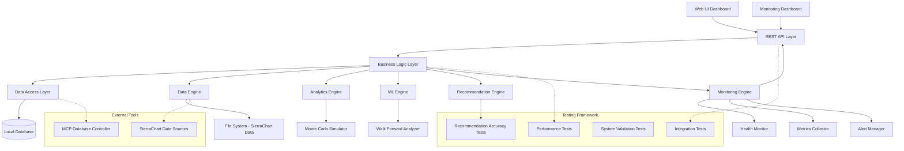

# Trading Optimization Platform - Design Document

## Overview

The Trading Optimization Platform is a comprehensive system that analyzes historical paper trading data to provide intelligent trading recommendations. The system processes data from SierraChart folders, applies statistical analysis and machine learning models, and generates optimal trading decisions based on time-of-day and day-of-week patterns while balancing profit maximization with risk minimization.

## Architecture

The system follows a modular, layered architecture with clear separation of concerns:



### Technology Stack

- **Backend**: Python with FastAPI for REST API
- **Database**: SQLite for local storage (controlled via MCP)
- **ML/Analytics**: scikit-learn, pandas, numpy, scipy
- **Frontend**: React with TypeScript for web dashboard
- **Visualization**: Plotly.js for interactive charts and monitoring dashboards
- **MCP Integration**: Model Context Protocol for database operations
- **Monitoring**: psutil for system metrics, custom metrics collection with Prometheus compatibility
- **Testing**: pytest for comprehensive testing framework, asyncio for performance testing
- **Alerting**: Multi-channel notification system (log, email, webhook)
- **Deployment**: Docker containerization support, production configuration management

## Components and Interfaces

### 1. Data Engine

**Purpose**: Handles data ingestion, cleaning, and preprocessing from SierraChart sources.

**Key Classes**:
- `DataIngestionService`: Reads files from SierraChart directories
- `DataCleaningService`: Removes incomplete trades and validates data
- `DataValidationService`: Ensures data integrity and account/asset separation

**Interfaces**:
```python
class IDataIngestionService:
    def ingest_from_path(self, path: str) -> List[TradeRecord]
    def validate_account_asset_separation(self, records: List[TradeRecord]) -> bool
    def clean_incomplete_trades(self, records: List[TradeRecord]) -> List[TradeRecord]
```

### 2. Analytics Engine

**Purpose**: Performs statistical analysis and generates performance metrics.

**Key Classes**:
- `PerformanceAnalyzer`: Calculates trading metrics (Sharpe ratio, drawdown, etc.)
- `TemporalAnalyzer`: Analyzes patterns by hour/day of week
- `StatisticalTestService`: Performs significance tests

**Interfaces**:
```python
class IAnalyticsEngine:
    def calculate_performance_metrics(self, trades: List[Trade]) -> PerformanceMetrics
    def analyze_temporal_patterns(self, trades: List[Trade]) -> TemporalPatterns
    def compare_accounts_statistical(self, account1: str, account2: str) -> ComparisonResult
```

### 3. Machine Learning Engine

**Purpose**: Trains and manages predictive models for trading optimization.

**Key Classes**:
- `ModelTrainer`: Handles model training with walk-forward analysis
- `PredictionService`: Generates predictions and confidence scores
- `ModelEvaluator`: Validates model performance

**Interfaces**:
```python
class IMLEngine:
    def train_model(self, features: DataFrame, target: Series) -> TrainedModel
    def predict_optimal_conditions(self, current_conditions: Dict) -> Prediction
    def evaluate_model_performance(self, model: TrainedModel) -> ModelMetrics
```

### 4. Monte Carlo Simulator

**Purpose**: Runs simulations to assess risk and potential outcomes.

**Key Classes**:
- `MonteCarloSimulator`: Executes simulation scenarios
- `RiskCalculator`: Computes VaR and Expected Shortfall
- `ScenarioGenerator`: Creates simulation parameters

**Interfaces**:
```python
class IMonteCarloSimulator:
    def run_simulation(self, parameters: SimulationParams) -> SimulationResults
    def calculate_var(self, returns: List[float], confidence: float) -> float
    def generate_scenarios(self, historical_data: DataFrame) -> List[Scenario]
```

### 5. Recommendation Engine

**Purpose**: Combines all analysis to generate trading recommendations.

**Key Classes**:
- `RecommendationService`: Main recommendation logic
- `RiskOptimizer`: Balances profit vs volatility
- `TimingAnalyzer`: Determines optimal trading times

**Interfaces**:
```python
class IRecommendationEngine:
    def get_current_recommendation(self, timestamp: datetime) -> TradingRecommendation
    def optimize_risk_return(self, candidates: List[TradingOption]) -> TradingOption
    def analyze_timing_patterns(self, asset: str, account: str) -> TimingPattern
```

### 6. Monitoring Engine

**Purpose**: Provides comprehensive system monitoring, health tracking, and alerting capabilities.

**Key Classes**:
- `HealthMonitorService`: Monitors system health (CPU, memory, disk, database)
- `MetricsCollector`: Collects API performance and business metrics
- `AlertManager`: Manages alert rules, notifications, and escalations
- `MonitoringMiddleware`: Automatic API request metrics collection

**Interfaces**:
```python
class IMonitoringEngine:
    def get_system_health(self) -> SystemHealth
    def collect_metrics(self, metric_name: str, value: float, labels: Dict) -> None
    def create_alert_rule(self, rule: AlertRule) -> None
    def get_active_alerts(self) -> List[Alert]
```

### 7. Testing Framework

**Purpose**: Comprehensive testing suite ensuring system reliability and accuracy.

**Key Components**:
- `EndToEndTests`: Complete workflow validation from ingestion to recommendations
- `PerformanceBenchmarks`: Load testing, memory usage, and concurrent operation validation
- `SystemValidationTests`: Business requirements validation through user story testing
- `RecommendationAccuracyTests`: Backtesting framework for recommendation engine validation

**Test Categories**:
```python
class ITestingFramework:
    def run_integration_tests(self) -> TestResults
    def benchmark_performance(self, scenarios: List[TestScenario]) -> PerformanceMetrics
    def validate_system_requirements(self) -> ValidationResults
    def test_recommendation_accuracy(self, historical_data: DataFrame) -> AccuracyMetrics
```

## Data Models

### Core Entities

```python
@dataclass
class SierraChartTradeRecord:
    # Core SierraChart fields
    activity_type: str  # "Fills"
    date_time: datetime
    trans_date_time: datetime
    service_order_id: str
    order_type: str  # Market, Limit, Stop, Stop Limit
    quantity: int
    order_status: str  # Filled
    trade_account: str  # IPS_TM_10, IPS_TM_13, etc.
    buy_sell: str  # Buy, Sell
    price: Optional[float]
    price2: Optional[float]
    fill_price: float
    filled_quantity: int
    note: str
    order_action_source: str
    internal_order_id: str
    symbol: str  # NQH24, FDAXM24, etc.
    open_close: str  # Open, Close
    parent_internal_order_id: Optional[str]
    position_quantity: int  # Running position balance
    fill_execution_service_id: str
    high_during_position: Optional[float]
    low_during_position: Optional[float]
    account_balance: float
    exchange_order_id: str
    client_order_id: str
    time_in_force: str
    username: str
    is_automated: str  # Y/N
    
    # Derived fields for analysis
    trade_id: str = field(init=False)
    is_complete_day_trade: bool = field(init=False)
    profit_loss: Optional[float] = field(init=False)

@dataclass
class ProcessedTrade:
    # Simplified trade record after processing
    trade_id: str
    account_name: str
    symbol: str
    entry_time: datetime
    exit_time: datetime
    entry_price: float
    exit_price: float
    quantity: int
    side: str  # 'LONG' or 'SHORT'
    profit_loss: float
    commission: float
    duration_minutes: int
    hour_of_day: int
    day_of_week: int

@dataclass
class Account:
    name: str  # IPS_TM_10, IPS_TM_13, etc.
    symbol: str  # NQ, FDAX, etc.
    total_trades: int
    first_trade_date: datetime
    last_trade_date: datetime
    is_active: bool

@dataclass
class PerformanceMetrics:
    account_name: str
    symbol: str
    period_start: datetime
    period_end: datetime
    total_return: float
    total_trades: int
    winning_trades: int
    losing_trades: int
    win_rate: float
    average_win: float
    average_loss: float
    profit_factor: float
    max_drawdown: float
    sharpe_ratio: float
    volatility: float
    largest_win: float
    largest_loss: float

@dataclass
class TradingRecommendation:
    timestamp: datetime
    account_name: str
    symbol: str
    recommended_action: str  # 'TRADE', 'AVOID'
    confidence_score: float
    expected_return: float
    expected_risk: float
    reasoning: str
    hour_of_day: int
    day_of_week: int
    historical_win_rate: float
    avg_profit_this_time: float
```

### Database Schema (SQLite)

```sql
-- Raw SierraChart data table
CREATE TABLE sierra_chart_fills (
    id INTEGER PRIMARY KEY AUTOINCREMENT,
    activity_type TEXT NOT NULL,
    date_time DATETIME NOT NULL,
    trans_date_time DATETIME NOT NULL,
    service_order_id TEXT NOT NULL,
    order_type TEXT NOT NULL,
    quantity INTEGER NOT NULL,
    order_status TEXT NOT NULL,
    trade_account TEXT NOT NULL,
    buy_sell TEXT NOT NULL,
    price REAL,
    price2 REAL,
    fill_price REAL NOT NULL,
    filled_quantity INTEGER NOT NULL,
    note TEXT,
    order_action_source TEXT,
    internal_order_id TEXT NOT NULL,
    symbol TEXT NOT NULL,
    open_close TEXT NOT NULL,
    parent_internal_order_id TEXT,
    position_quantity INTEGER NOT NULL,
    fill_execution_service_id TEXT,
    high_during_position REAL,
    low_during_position REAL,
    account_balance REAL NOT NULL,
    exchange_order_id TEXT,
    client_order_id TEXT,
    time_in_force TEXT,
    username TEXT,
    is_automated TEXT,
    file_source TEXT NOT NULL,  -- Track which file this came from
    import_timestamp DATETIME DEFAULT CURRENT_TIMESTAMP,
    UNIQUE(service_order_id, internal_order_id)  -- Prevent duplicates
);

-- Processed trades table (complete round trips)
CREATE TABLE processed_trades (
    id INTEGER PRIMARY KEY AUTOINCREMENT,
    trade_id TEXT UNIQUE NOT NULL,
    account_name TEXT NOT NULL,
    symbol TEXT NOT NULL,
    entry_time DATETIME NOT NULL,
    exit_time DATETIME NOT NULL,
    entry_price REAL NOT NULL,
    exit_price REAL NOT NULL,
    quantity INTEGER NOT NULL,
    side TEXT NOT NULL,  -- 'LONG' or 'SHORT'
    profit_loss REAL NOT NULL,
    commission REAL DEFAULT 0,
    duration_minutes INTEGER NOT NULL,
    hour_of_day INTEGER NOT NULL,
    day_of_week INTEGER NOT NULL,
    entry_order_id TEXT NOT NULL,
    exit_order_id TEXT NOT NULL,
    created_timestamp DATETIME DEFAULT CURRENT_TIMESTAMP
);

-- Accounts table
CREATE TABLE accounts (
    name TEXT PRIMARY KEY,  -- IPS_TM_10, IPS_TM_13, etc.
    symbol TEXT NOT NULL,   -- NQ, FDAX, etc.
    total_trades INTEGER DEFAULT 0,
    first_trade_date DATETIME,
    last_trade_date DATETIME,
    is_active BOOLEAN DEFAULT TRUE,
    created_timestamp DATETIME DEFAULT CURRENT_TIMESTAMP
);

-- Performance metrics table
CREATE TABLE performance_metrics (
    id INTEGER PRIMARY KEY AUTOINCREMENT,
    account_name TEXT NOT NULL,
    symbol TEXT NOT NULL,
    period_start DATETIME NOT NULL,
    period_end DATETIME NOT NULL,
    total_return REAL NOT NULL,
    total_trades INTEGER NOT NULL,
    winning_trades INTEGER NOT NULL,
    losing_trades INTEGER NOT NULL,
    win_rate REAL NOT NULL,
    average_win REAL NOT NULL,
    average_loss REAL NOT NULL,
    profit_factor REAL NOT NULL,
    max_drawdown REAL NOT NULL,
    sharpe_ratio REAL,
    volatility REAL NOT NULL,
    largest_win REAL NOT NULL,
    largest_loss REAL NOT NULL,
    calculation_timestamp DATETIME DEFAULT CURRENT_TIMESTAMP,
    FOREIGN KEY (account_name) REFERENCES accounts(name)
);

-- Temporal analysis table (performance by hour/day)
CREATE TABLE temporal_performance (
    id INTEGER PRIMARY KEY AUTOINCREMENT,
    account_name TEXT NOT NULL,
    symbol TEXT NOT NULL,
    hour_of_day INTEGER,  -- NULL for day-of-week analysis
    day_of_week INTEGER,  -- NULL for hour-of-day analysis
    total_trades INTEGER NOT NULL,
    winning_trades INTEGER NOT NULL,
    total_pnl REAL NOT NULL,
    average_pnl REAL NOT NULL,
    win_rate REAL NOT NULL,
    calculation_timestamp DATETIME DEFAULT CURRENT_TIMESTAMP,
    FOREIGN KEY (account_name) REFERENCES accounts(name)
);

-- Recommendations table
CREATE TABLE recommendations (
    id INTEGER PRIMARY KEY AUTOINCREMENT,
    timestamp DATETIME NOT NULL,
    account_name TEXT NOT NULL,
    symbol TEXT NOT NULL,
    recommended_action TEXT NOT NULL,  -- 'TRADE', 'AVOID'
    confidence_score REAL NOT NULL,
    expected_return REAL,
    expected_risk REAL,
    reasoning TEXT,
    hour_of_day INTEGER NOT NULL,
    day_of_week INTEGER NOT NULL,
    historical_win_rate REAL,
    avg_profit_this_time REAL,
    created_timestamp DATETIME DEFAULT CURRENT_TIMESTAMP,
    FOREIGN KEY (account_name) REFERENCES accounts(name)
);

-- Indexes for performance
CREATE INDEX idx_sierra_fills_account_symbol ON sierra_chart_fills(trade_account, symbol);
CREATE INDEX idx_sierra_fills_datetime ON sierra_chart_fills(date_time);
CREATE INDEX idx_processed_trades_account_time ON processed_trades(account_name, entry_time);
CREATE INDEX idx_processed_trades_temporal ON processed_trades(hour_of_day, day_of_week);
CREATE INDEX idx_temporal_perf_lookup ON temporal_performance(account_name, symbol, hour_of_day, day_of_week);
```

## Error Handling

### Data Processing Errors
- **File Access Issues**: Retry mechanism with exponential backoff
- **Data Corruption**: Quarantine corrupted records and alert administrators
- **Incomplete Trades**: Log removal actions and maintain audit trail

### Model Errors
- **Training Failures**: Fallback to previous model version
- **Prediction Errors**: Return confidence intervals and uncertainty measures
- **Performance Degradation**: Automatic retraining triggers

### Database Errors
- **Connection Issues**: Connection pooling and retry logic
- **Transaction Failures**: Rollback mechanisms and data consistency checks
- **MCP Communication**: Fallback to direct database access if MCP fails

### API Errors
- **Rate Limiting**: Implement throttling and queue management
- **Authentication Failures**: Secure logging and lockout mechanisms
- **Data Validation**: Comprehensive input sanitization

## Testing Strategy

### Unit Testing
- **Data Processing**: Test data cleaning, validation, and transformation logic
- **Analytics**: Verify statistical calculations and metric computations
- **ML Models**: Test training, prediction, and evaluation functions
- **Database Operations**: Mock MCP interactions and test CRUD operations

### Integration Testing
- **End-to-End Data Flow**: Test complete pipeline from file ingestion to recommendations
- **MCP Integration**: Test database operations through MCP interface
- **API Endpoints**: Test all REST API functionality
- **UI Components**: Test dashboard interactions and data visualization

### Performance Testing
- **Data Processing**: Test with large datasets from SierraChart
- **Model Training**: Benchmark training times and memory usage
- **Database Queries**: Test query performance with historical data
- **Concurrent Users**: Load testing for multiple dashboard users

### Validation Testing
- **Walk-Forward Analysis**: Validate model performance on out-of-sample data
- **Monte Carlo Validation**: Verify simulation accuracy against historical results
- **Recommendation Accuracy**: Backtest recommendations against actual outcomes
- **Data Integrity**: Ensure account/asset separation is maintained

## MCP Integration Details

### Database Controller Setup
The system will use MCP (Model Context Protocol) to control the local SQLite database:

1. **MCP Server Configuration**: Set up MCP server to handle database operations
2. **Connection Management**: Establish secure connections between application and MCP
3. **Query Interface**: Use MCP to execute SQL queries and manage transactions
4. **Error Handling**: Implement fallback mechanisms if MCP is unavailable

### Required MCP Tools
- Database query execution
- Transaction management
- Schema migration support
- Backup and restore operations

## Security Considerations

### Data Protection
- **Local Storage**: SQLite database with file-level encryption
- **Access Control**: Role-based permissions for different user types
- **Audit Logging**: Comprehensive logging of all data access and modifications

### API Security
- **Authentication**: JWT tokens for API access
- **Rate Limiting**: Prevent abuse and ensure fair resource usage
- **Input Validation**: Sanitize all inputs to prevent injection attacks

## Deployment Architecture

### Local Development
- **Database**: SQLite file in application directory
- **MCP Server**: Local MCP instance for database control
- **Web Server**: Development server for UI and API

### Production Setup
- **Database**: Optimized SQLite with proper indexing
- **MCP Integration**: Production MCP configuration
- **Web Interface**: Optimized build with caching and compression
- **Monitoring**: Health checks and performance monitoring

## Implementation Status

### Completed Components (✅)
- **Backend Services**: Data ingestion, statistical analysis, machine learning, Monte Carlo simulation, recommendation engine
- **API Layer**: REST endpoints with comprehensive models and authentication
- **Database Layer**: SQLite with MCP integration for all data operations
- **Web Dashboard UI**: React TypeScript application with interactive visualizations

### UI Components Implemented (✅)
- **MetricCard**: Reusable performance metric display with trends and formatting
- **PerformanceMetrics**: Comprehensive dashboard showing key trading statistics
- **TemporalChart**: Interactive Plotly.js charts for hourly/daily pattern analysis
- **MonteCarloChart**: Advanced risk visualization with distribution charts
- **RecommendationCard**: Rich recommendation display with reasoning and auto-refresh
- **Dashboard**: Main interface with account selection and tabbed navigation

### Key Features Available (✅)
- **Real-time Recommendations**: Auto-refreshing trading suggestions with confidence scores
- **Interactive Analytics**: Temporal pattern analysis with statistical significance testing
- **Risk Assessment**: Monte Carlo simulations with VaR and percentile distributions
- **Performance Tracking**: Complete trading metrics with historical comparisons
- **Responsive Design**: Mobile-friendly interface with adaptive layouts

### Recently Completed (✅)
- **Web Dashboard UI**: Complete React TypeScript application with Redux state management
- **Component Architecture**: Modular components with proper error boundaries and loading states
- **API Integration**: Full integration with backend REST endpoints for all data operations
- **Responsive Design**: Mobile-friendly interface with tabbed navigation and account selection
- **Error Handling**: Comprehensive error boundaries and graceful degradation
- **Testing Suite**: Unit tests for components, integration tests, and end-to-end workflow tests

### Remaining Tasks (🔄)
- **Monitoring System**: Health checks, performance metrics, alerting
- **System Validation**: Integration testing, acceptance testing, performance benchmarking
- **Documentation**: User guides, technical documentation, deployment procedures