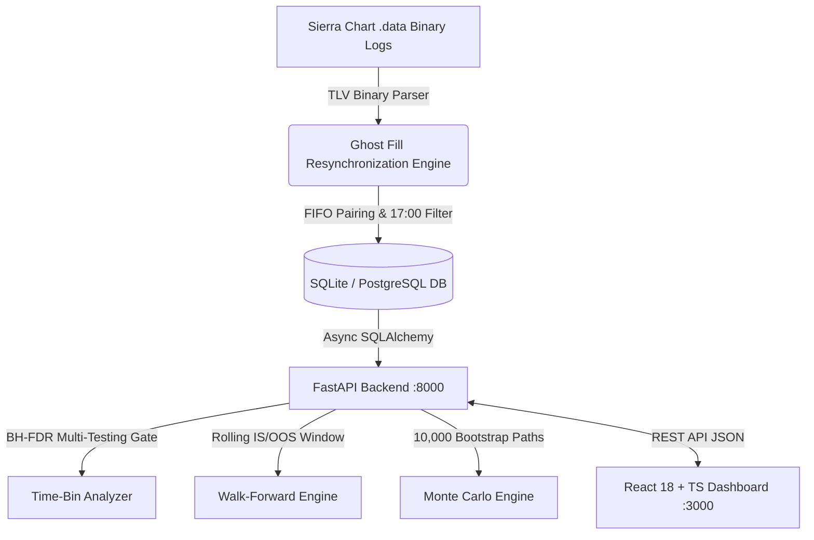

# Sierra Chart Trade Optimization Platform

> **A full-stack trading analytics platform** that parses Sierra Chart binary trade logs into SQLite/PostgreSQL and applies statistical filtering (Benjamini-Hochberg FDR correction) to identify time-of-day trading edge.

---

## 🚀 Quick Start

Get the system up and running in **3 commands**:

```bash
cp .env.example .env
docker-compose up --build
# Backend available at http://localhost:8000/docs
# Frontend dashboard available at http://localhost:3000
```

---

## 🏛️ System Architecture



---

## 📌 API Endpoint Reference Table

| Category | Method | Endpoint | Description |
| :--- | :--- | :--- | :--- |
| **System** | `GET` | `/health` | Server & DB health check status |
| **Trades** | `GET` | `/api/v1/trades` | List trades with dynamic filters & pagination |
| **Trades** | `GET` | `/api/v1/trades/summary` | Daily aggregated PnL summaries |
| **Analytics** | `GET` | `/api/v1/analytics/summary` | Overall performance snapshot |
| **Analytics** | `GET` | `/api/v1/analytics/by-account` | Sortino-ranked account leaderboard |
| **Analytics** | `GET` | `/api/v1/analytics/by-symbol` | Symbol breakdown table |
| **Analytics** | `GET` | `/api/v1/analytics/time-slots` | BH-FDR time-slot grid & Plotly heatmap matrix |
| **Analytics** | `GET` | `/api/v1/analytics/pnl-curve` | Cumulative daily PnL series |
| **Analytics** | `GET` | `/api/v1/analytics/drawdown` | Daily equity drawdown series |
| **Walk-Forward** | `POST` | `/api/v1/walkforward/run` | Trigger async walk-forward test job |
| **Walk-Forward** | `GET` | `/api/v1/walkforward/jobs/{id}` | Poll background job status |
| **Walk-Forward** | `GET` | `/api/v1/walkforward/results/{id}` | Retrieve completed walk-forward results |
| **Recommendations** | `GET` | `/api/v1/recommendations` | Strategy recommendations ranked by Sharpe |
| **Ingestion** | `POST` | `/api/v1/ingest` | Trigger binary log parsing job |

---

## ⚙️ Environment Variables Reference

| Variable | Default Value | Description |
| :--- | :--- | :--- |
| `ENV` | `development` | Environment stage (`development`, `staging`, `production`) |
| `HOST` | `0.0.0.0` | Server listen host interface |
| `PORT` | `8000` | Server listen port |
| `DATABASE_URL` | `sqlite+aiosqlite:///./data/trading_platform.db` | SQLAlchemy async database connection string |
| `SECRET_KEY` | `change-me...` | Application secret key for session signatures |
| `API_KEY` | `""` | Optional API key header verification (disabled if empty) |
| `ALLOWED_ORIGINS` | `http://localhost:3000,http://localhost:5173` | Comma-separated CORS allowed origins |
| `BH_FDR_ALPHA` | `0.05` | Benjamini-Hochberg FDR significance threshold |
| `MIN_TRADES_FOR_PROMOTION` | `30` | Minimum trade count required for time-slot promotion |
| `WF_IN_SAMPLE_DAYS` | `252` | Walk-forward training window length in trading days |
| `WF_OUT_OF_SAMPLE_DAYS` | `63` | Walk-forward test window length in trading days |
| `MC_SIMULATIONS` | `10000` | Number of bootstrap paths for Monte Carlo simulation |
| `MC_RUIN_THRESHOLD` | `0.50` | Drawdown fraction to declare ruin (0.50 = 50%) |

---

## 📁 Project Structure

```text
SC_results_WF/
├── backend/                       # Python 3.11 FastAPI Monorepo Backend
│   ├── api/                       # Router definitions & FastAPI app factory
│   ├── core/                      # Configuration settings & structured logging
│   ├── db/                        # SQLAlchemy async engine & declarative base
│   ├── models/                    # SQLAlchemy ORM models (Trade, Analytics, Jobs)
│   ├── schemas/                   # Pydantic v2 validation schemas
│   ├── services/                  # Core algorithms (BH-FDR, WalkForward, MonteCarlo)
│   └── main.py                    # Uvicorn entrypoint
├── frontend/                      # React 18 + TypeScript + Redux Toolkit Dashboard
│   ├── src/api/                   # Axios API client
│   ├── src/pages/                 # Page components (Dashboard, Analytics, Recs, WF, MC)
│   ├── src/store/                 # Redux Toolkit store and slices
│   └── src/types/                 # TypeScript interface definitions
├── docs/                          # Architectural blueprints, audits & reports
├── tests/                         # Unit and integration test suite
│   ├── unit/                      # Isolated module unit tests
│   └── integration/               # Pipeline & API integration tests
├── .github/workflows/ci.yml       # GitHub Actions CI workflow
├── Dockerfile                     # Multi-stage production build
├── docker-compose.yml             # Docker stack configuration
├── Makefile                       # Developer command shortcuts
├── reorganize.py                  # Phase 1 monorepo cleanup tool
└── README.md                      # Platform overview and documentation
```

---

## 🛠️ Technology Stack

| Layer | Technology |
| :--- | :--- |
| **Backend Framework** | Python 3.11+, FastAPI, Uvicorn, Pydantic v2 |
| **Database & ORM** | SQLAlchemy 2.0 (Async), Asyncpg / Aiosqlite, Alembic |
| **Analytics Engine** | SciPy, NumPy, Pandas, Scikit-learn |
| **Frontend UI** | React 18, TypeScript, Redux Toolkit, Plotly.js, Axios |
| **DevOps & Testing** | Docker, Docker Compose, Pytest, GitHub Actions CI |

---

## 🔐 Security & Governance

- All credentials (SECRET_KEY, DATABASE_URL, API_KEY) are sourced from `.env` — **never committed**.
- `.gitignore` explicitly excludes `.env`, `dataset/`, `*.db`, `*.log`.
- Strict path traversal validation on file ingestion.
- Standardized CORS origin protection.
